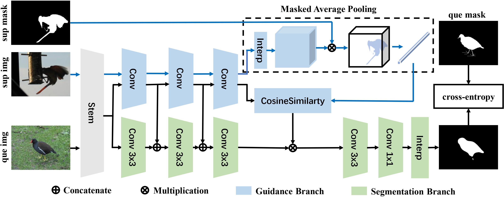

### [SG-One: Similarity Guidance Network for One-Shot Semantic Segmentation](https://arxiv.org/abs/1810.09091)

# Overview of SG-One


# Train
You can use the scripts in `scripts` to train your model on different splits of the VOC2012 dataset.
For example, 
```
cd scripts
base train_group0.sh
```


# Test
You can use `val_frame_all_mlclasses.py` to test your trained models.


### Citation
If you find this code helpful, please consider to cite this paper:
```
@inproceedings{zhang2020self,
  title={Self-produced Guidance for Weakly-supervised Object Localization},
  author={Zhang, Xiaolin and Wei, Yunchao and Yang, Yi},
  journal={IEEE Transactions on Cybernetics}, 
  year={2020}, 
}
```


